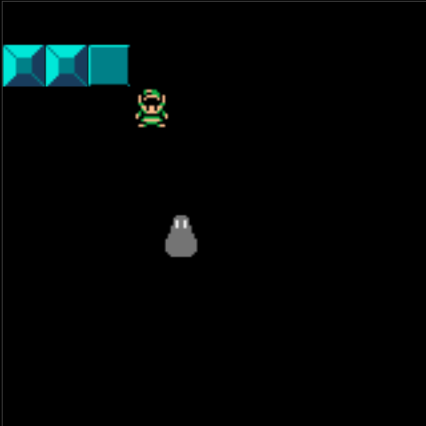

This is a simple game with ripped Zelda sprites written using
Ruby and [Gosu](https://www.libgosu.org/ruby.html).

Getting started:

```
bundler install # Install dependencies
rake run        # Run the program
rake test       # Run the unit tests
```


